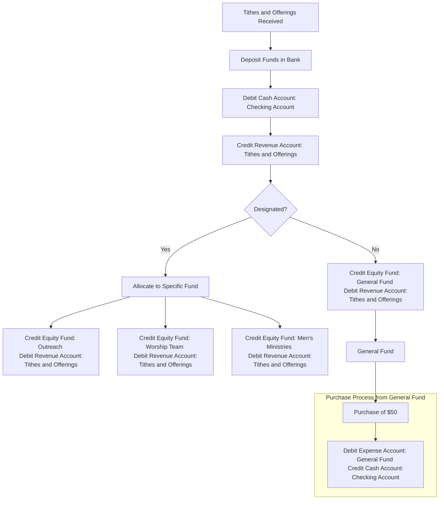
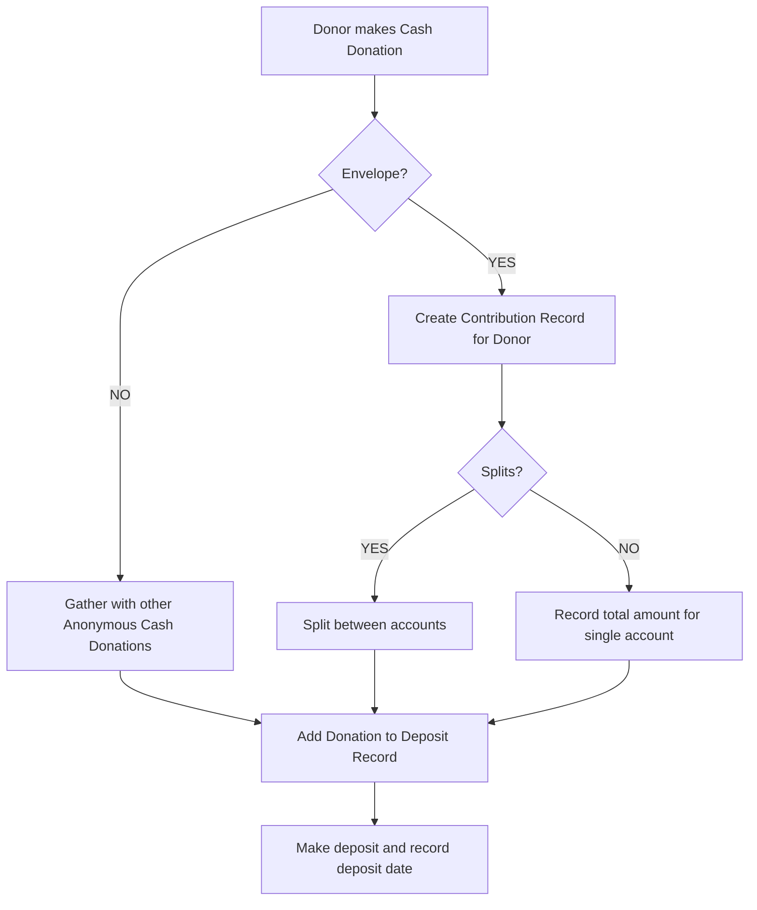
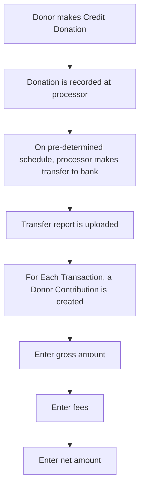

# Understanding Contributions
Contributions are the lifeblood of the church from a financial perspective.  Following generally accepted accounting principles (GAAP) is critical to providing a solid financial reporting platform.

## Base Accounts and Account Ledgers
The General Ledger is the master record of all transactions

<details><summary>General Accounting Flow</summary>


</details>

<details>
<summary>Model Definition</summary>

| PROPERTY | DEFINITION                                    | TYPE | REQUIRED | DEFAULT |
|:----------|:---------------------------------------------|:----:|:--------:|:-------:|
| **gross** | The total amount, in pennies, including any fees associated with the transaction that the church has to pay, or is payed for on behalf of the church by the contributor. | Number | Yes |  |
| **fees** | Any amount charged, in pennies, by the processor of the credit card. In some cases, the contributor may cover the processing fee. | Number | Yes | 0 |
| **net** | The value of the contribution.  Net is equal to gross minus fees | Number | Yes | n = g - f |
| **transactionDate** | The date the transaction occurred.  For credit card transactions, this is the actual date of the "swipe". For cash contributions, it is the date the contribution was given to the church. | Date | Yes | Date.now() |
| **depositDate** | The date of a **cash deposit** to the bank account | Date | No |  |
| **approvalDate** | This is the date that an transfer from a credit card processor (SubSplash) was approved to be deposited. This **IS NOT** the date of the actual transfer.  The transfer records must be approved and any adjustments made so that contributions are recorded correctly. | Date | No |  |
| **approvedBy** | The id of the profile that approved a transfer from a credit card processor.  This provides a linkage to the person that approved the transfer. | ObjectId | No |  |
| **depositBatchId** | The identifier for a deposit, wether generated from a credit card transfer or a cash deposit. | ObjectId | No |  |
| **type** | Must be cash, check, credit | String | Yes | cash |
| **accounts** | This property details how a contribution is subdivided.  Sometimes, people will make a single contribution, but ask that it be split between several accounts.  This has a built in validator that requires that the sum of the amounts in the accounts array is equal to the net value of the contribution. | Array | Yes | ```[{"account":"accountId", "amount":"number"}]``` |
| **profile** | The profile of the person making the contribution if known | ObjectId | No |  |

</details>

<details>
<summary>Contribution Examples</summary>

| Scenario | Gross | Fees | Net | Record against a Profile|
|---|:---:|:---:|:---:|:---:|
|**A person makes an $20 cash contribution anonymously**|$20.00|$0.00|$20.00|No|
|**A person makes an $20 cash contribution using an tithe envelope**|$20.00|$0.00|$20.00|Yes|
|**A person makes an $20 credit card contribution**|$20.00|$1.50|$18.50|Yes|
|**A person makes an $20 credit card contribution AND covers the fees**|$21.50|$1.50|$20.00|Yes|

</details>

<details><summary>Cash Donation Workflow</summary>


</details>

<details><summary>Credit Donation Workflow</summary>


</details>

