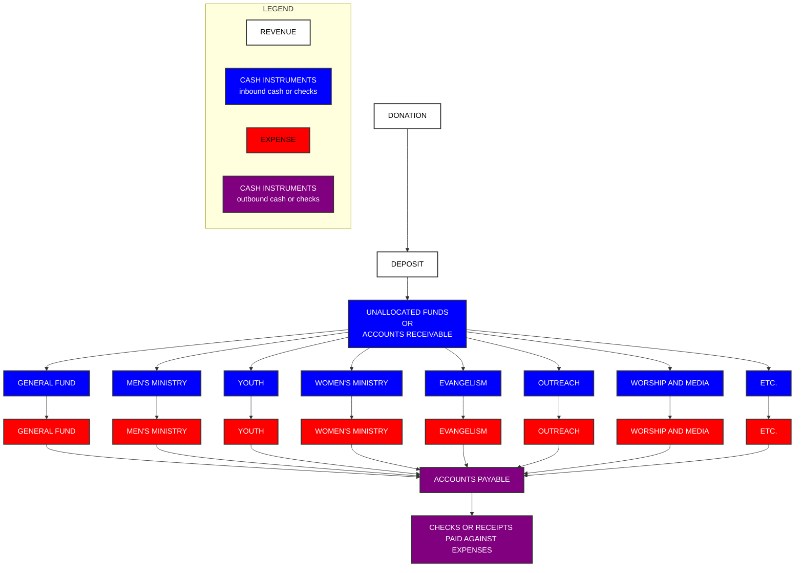
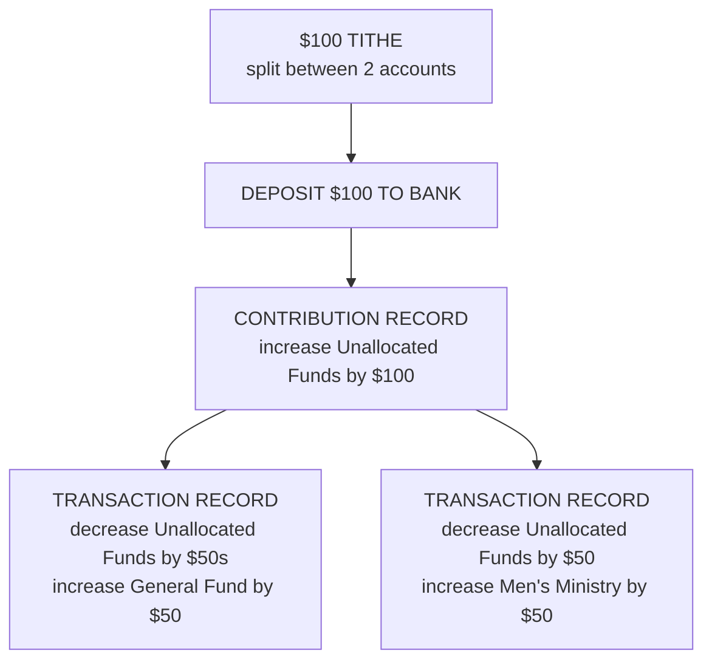
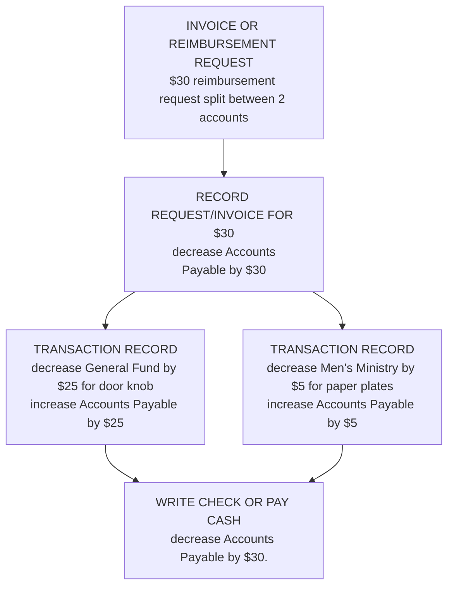

# Understanding Contributions
Contributions are the lifeblood of the church from a financial perspective.  Following generally accepted accounting principles (GAAP) is critical to providing a solid financial reporting platform.  There are several types of accounting system available:

- Financial Accounting:
  - Focus: Reporting financial information to external users such as investors, creditors, and regulators.
  - Key Outputs: Financial statements (balance sheet, income statement, cash flow statement, and statement of changes in equity).
  - Standards: Governed by generally accepted accounting principles (GAAP) or international financial reporting standards (IFRS).
- Managerial Accounting:
  - Focus: Providing information for internal management to assist in decision-making, planning, and control.
  - Key Outputs: Budget reports, performance reports, cost analysis, and other internal documents.
  - Standards: Not governed by external standards; more flexible and tailored to management needs.
- Tax Accounting:
  - Focus: Preparing tax returns and planning for future tax obligations.
  - Key Outputs: Tax returns and related documents.
  - Standards: Governed by tax laws and regulations of the relevant jurisdiction.
- Auditing:
  - Focus: Examining financial records and statements to ensure accuracy and compliance with accounting standards and regulations.
  - Key Outputs: Audit reports.
  - Standards: Governed by auditing standards such as those set by the Public Company Accounting Oversight Board (PCAOB) or the International Auditing and Assurance Standards Board (IAASB).
- Fund Accounting:
  - Focus: Used by non-profit organizations and governments to track resources allocated for specific purposes.
  - Key Outputs: Fund financial statements.
  - Standards: Governed by specific regulations such as the Governmental Accounting Standards Board (GASB) for governmental entities.
- Cost Accounting:
  - Focus: Analyzing the costs of production or services to manage and control costs.
  - Key Outputs: Cost reports, variance analysis, and cost allocation reports.
  - Standards: Often used within managerial accounting and follows internal guidelines.
- Forensic Accounting:
  - Focus: Investigating financial records to detect and prevent fraud and embezzlement.
  - Key Outputs: Forensic reports and evidence for legal proceedings.
  - Standards: Involves adherence to legal and investigative standards.
- Government Accounting:
  - Focus: Managing and reporting public funds.
  - Key Outputs: Government financial statements and budgets.
  - Standards: Governed by the Governmental Accounting Standards Board (GASB) or similar bodies.
- Environmental Accounting:
  - Focus: Incorporating environmental costs and considerations into financial decision-making and reporting.
  - Key Outputs: Environmental impact reports, sustainability reports.
  - Standards: Evolving standards, often influenced by regulatory requirements and sustainability initiatives.
  - Project Accounting:
  - Focus: Tracking financial progress of specific projects.
  - Key Outputs: Project financial reports, budget vs. actual analysis.
  - Standards: Often part of managerial accounting, tailored to project needs.
- International Accounting:
  - Focus: Accounting practices for businesses operating in multiple countries.
  - Key Outputs: Consolidated financial statements for international operations.
  - Standards: Governed by International Financial Reporting Standards (IFRS).

Most churches use **Fund Accounting**.

## Understanding Debits and Credits from an account perspective

There are two types of actions in a double-entry accounting system.  Debits and Credits.  You can think of them as the Heads and Tails of a single coin, or like Newton's third law of motion - For every action, there is an equal and oposite reaction. 

Wether a transaction is a debit or a credit depends on the the account that you are are working with, AND, the nature of the action being taken on that account

The items in an accounting system:

| **DEBITS**<br/>the source of a transaction | **CREDITS**<br/>the destination of a transaction |
|:---:|:---:|
|**DIVIDENDS**<br/>cash given to business owners<br/>by the business|**LIABILITIES**<br/>cash owed to a bank for a loan or<br/>to a service provider for a goods and services|
|**EXPENSES**<br/> things we purchase|**EQUITY**<br/>cash given to a business<br/>by the business owners |
|**ASSETS**<br/>cash, buidlings,<br/>or what others owe you|**REVENUE**<br/> Cash inflow into the business|

<br/>
<br/>

The base accounting equation for GENERAL accounting:

<span style="background-color: blue; color: white;">ASSETS</span> **=** 
<span style="background-color: lightblue; color: black;">LIABILITES</span> **+** 
<span style="background-color: orange; color: white;">EEQUITY</span> 

The definition of equity:

<span style="background-color: orange; color: white;">EQUITY</span> **=** 
<span style="background-color: green; color: black;">OWNER'S EQUITY</span> **-** 
<span style="background-color: gray; color: black;">DIVIDENDS</span> **+**
<span style="background-color: yellow; color: black;">RETAINED EARNINGS</span>

The definition of retained earnings:

<span style="background-color: yellow; color: black;">RETAINED EARNINGS</span> **=** 
<span style="background-color: lightgreen; color: black;">REVENUE</span> **-** 
<span style="background-color: red; color: white;">EXPENSES</span>

Using substitution to expand the EQUITY equation you get:

<span style="background-color: orange; color: white;">EQUITY</span> **=** 
<span style="background-color: green; color: black;">OWNER'S EQUITY</span> **-** 
<span style="background-color: gray; color: black;">DIVIDENDS</span> **+**
<span style="background-color: lightgreen; color: black;">REVENUE</span> **-** 
<span style="background-color: red; color: white;">EXPENSES</span>

Using substitution to expand the basic accounting equation you get:

<span style="background-color: blue; color: white;">ASSETS</span> **=** 
<span style="background-color: lightblue; color: black;">LIABILITES</span> **+**
<span style="background-color: green; color: black;">OWNER'S EQUITY</span> **-** 
<span style="background-color: gray; color: black;">DIVIDENDS</span> **+**
<span style="background-color: lightgreen; color: black;">REVENUE</span> **-** 
<span style="background-color: red; color: white;">EXPENSES</span>

Rearranging and balancing the expanded equation
<div style="text-align: center; width: 45%; border: 2px solid yellow; padding: 10px; display: inline-block;">DEBITS
</div>&nbsp;&nbsp;&nbsp;
<div style="text-align: center; width: 45%; border: 2px solid yellow; padding: 10px; display: inline-block;">CREDITS
</div>
<div style="text-align: center; width: 45%; border: 2px solid yellow; padding: 10px; display: inline-block;">
    <span style="background-color: gray; color: black;">DIVIDENDS</span> + 
    <span style="background-color: red; color: white;">EXPENSES</span> + 
    <span style="background-color: blue; color: white;">ASSETS</span>
</div>
 =
<div style="text-align: center; width: 45%; border: 2px solid yellow; padding: 10px; display: inline-block;">
    <span style="background-color: lightblue; color: black;">LIABILITES</span> +  
    <span style="background-color: green; color: black;">OWNER'S EQUITY</span> +  
    <span style="background-color: lightgreen; color: black;">REVENUE</span>
</div>
<div style="text-align: center; width: 45%; border: 2px solid yellow; padding: 10px; display: inline-block;">Debits increase when debited and decrease when credited
</div>&nbsp;&nbsp;&nbsp;
<div style="text-align: center; width: 45%; border: 2px solid yellow; padding: 10px; display: inline-block;">Credits increase when credited and decrease when debited
</div>
<br/>
<br/>
It may be easier to think of Debit vs. Credit in the framework of what we call the transaction, not what the transaction is.

## Adaption for Fund Accounting
A church, as a non-profit, typically does not have owners, and thus does not typically deal with owner's equity or owner's dividends.  The accounting process works much like traditional accounting.  The difference being that when a person donates money to a certain "cause" of the church, like missions, or youth or worship team, that money is required to be earmarked and tracked as such so that not only the income can be recorded correctly, but also any money spent in support of that ministry is also recorded against those same dollars.

We adopt our formula to look like this:
### <span style="background-color: blue; color: white;">ASSETS</span> = <span style="background-color: lightblue; color: black;">LIABILITES</span> +  <span style="background-color: lightgreen; color: black;">FUND BALANCES</span>

### How this works mathematically
At the end of the day the increase or decrease of the amount in any given account is the same.  Money in increases the dollar amount in the account, money out decreases the dollar amount in the account.  HOWEVER, what we call it is different from an accounting and reporting perspective.  This is primarily due to the nature of the account.

For example, the church has an account in the system called General Fund.  This is typically a general use cash account, much like a checking account.  If you put a contribution of $100 in, you expect the value to go up $100.  This would be considered a "FUND" account.  The $100 transaction, from the General Funds perspective is a credit.

The church may also have other accounts, much like the General Fund, but with a more specific focus, like Outreach, or Men's Ministry, etc.

### GENERAL Cash Flow


### Specific Example of Cash Flow
#### Revenue (Tithes, Offerings, Donations)

#### Expenses
Graphing the expenses, from a practical application perspective, are a little tricky depending on how the church operates.  At the end of the day, in order to write a check or disperse a cashe reimbursement, there should be an expense recorded in the form of an invoice, or reimbursement request.  The reimbursement request is where it get's a bit "unofficial" looking because it can be just a receipt with a hand written note on it.  Dont get too caught up in the method of the request, just understand that the request happened.



---
### Drawings
<details>
<summary>Model Definition</summary>

| PROPERTY | DEFINITION                                    | TYPE | REQUIRED | DEFAULT |
|:----------|:---------------------------------------------|:----:|:--------:|:-------:|
| **gross** | The total amount, in pennies, including any fees associated with the transaction that the church has to pay, or is payed for on behalf of the church by the contributor. | Number | Yes |  |
| **fees** | Any amount charged, in pennies, by the processor of the credit card. In some cases, the contributor may cover the processing fee. | Number | Yes | 0 |
| **net** | The value of the contribution.  Net is equal to gross minus fees | Number | Yes | n = g - f |
| **transactionDate** | The date the transaction occurred.  For credit card transactions, this is the actual date of the "swipe". For cash contributions, it is the date the contribution was given to the church. | Date | Yes | Date.now() |
| **depositDate** | The date of a **cash deposit** to the bank account | Date | No |  |
| **approvalDate** | This is the date that an transfer from a credit card processor (SubSplash) was approved to be deposited. This **IS NOT** the date of the actual transfer.  The transfer records must be approved and any adjustments made so that contributions are recorded correctly. | Date | No |  |
| **approvedBy** | The id of the profile that approved a transfer from a credit card processor.  This provides a linkage to the person that approved the transfer. | ObjectId | No |  |
| **depositBatchId** | The identifier for a deposit, wether generated from a credit card transfer or a cash deposit. | ObjectId | No |  |
| **type** | Must be cash, check, credit | String | Yes | cash |
| **accounts** | This property details how a contribution is subdivided.  Sometimes, people will make a single contribution, but ask that it be split between several accounts.  This has a built in validator that requires that the sum of the amounts in the accounts array is equal to the net value of the contribution. | Array | Yes | ```[{"account":"accountId", "amount":"number"}]``` |
| **profile** | The profile of the person making the contribution if known | ObjectId | No |  |

</details>

<details>
<summary>Contribution Examples</summary>

| Scenario | Gross | Fees | Net | Record against a Profile|
|---|:---:|:---:|:---:|:---:|
|**A person makes an $20 cash contribution anonymously**|$20.00|$0.00|$20.00|No|
|**A person makes an $20 cash contribution using an tithe envelope**|$20.00|$0.00|$20.00|Yes|
|**A person makes an $20 credit card contribution**|$20.00|$1.50|$18.50|Yes|
|**A person makes an $20 credit card contribution AND covers the fees**|$21.50|$1.50|$20.00|Yes|

</details>


